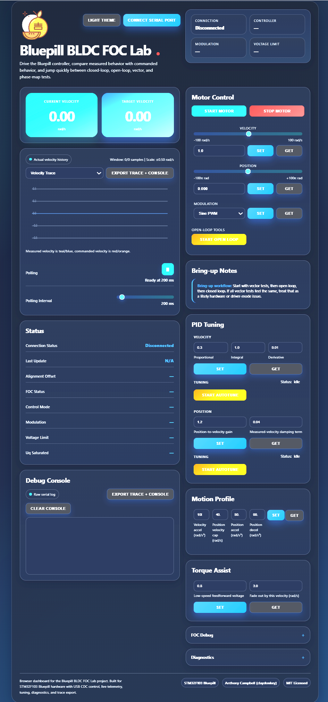

# Bluepill BLDC FOC Lab

[](https://bldc.claydonkey.com)

This project is a field-oriented control (FOC) motor-control application for a Bluepill-class `STM32F103CBT6` board, with:

- USB CDC command and telemetry
- a browser dashboard built with `index.html` + `app.js`
- AS5600 magnetic encoder feedback
- velocity and position control modes
- runtime tuning and trace export from the web UI
- DFU-based firmware update support

## Live Demo

[Open the Bluepill BLDC FOC Lab Web App](https://bldc.claydonkey.com)

## Mission

This project is part of a teaching course aimed at ages `9-16`.

The goal is to make BLDC control, embedded systems, and practical motor tuning approachable on very low-cost hardware, while still leaving enough depth for more advanced experimentation.

The repository is set up so the application firmware lives at `0x08001000` and is flashed over USB using `dfu-util`.

That only works after the board has first been prepared with the included bootloader image:

- [bootloader-dfu-fw.bin](./bootloader-dfu-fw.bin)

## Web Dashboard Snapshot



## What This Repo Contains

- `Core/`, `Drivers/`, `Middlewares/`, `USB_DEVICE/`
  - STM32 firmware source
- [index.html](./web/index.html)
  - browser dashboard
- [app.js](./web/app.js)
  - Web Serial UI, telemetry plots, tuning, trace export
- [TELEMETRY_PROTOCOL.md](./TELEMETRY_PROTOCOL.md)
  - USB command and telemetry packet reference
- [bootloader-dfu-fw.bin](./bootloader-dfu-fw.bin)
  - bootloader image that must be flashed once before DFU updates
- [CMakeLists.txt](./CMakeLists.txt)
  - CMake build and DFU flash targets
- [stm32f103cbt6_foc.ioc](./stm32f103cbt6_foc.ioc)
  - STM32CubeMX project

## Hardware

This project is currently being developed with the following hardware stack.

### Bill of Materials

- Controller board: Bluepill `STM32F103CBT6`
  - approximate cost: `US$1-2`
- Motor driver: `SimpleFOC Mini`
  - approximate cost: `US$6-7`
  - <https://www.aliexpress.com/item/1005006504369450.html?spm=a2g0o.productlist.main.18.25443ff6j7vU89&algo_pvid=54839512-1b0a-4570-9da2-1c32a8dc5dbe&pdp_ext_f=%7B%22order%22%3A%22219%22%2C%22spu_best_type%22%3A%22price%22%2C%22eval%22%3A%221%22%2C%22fromPage%22%3A%22search%22%7D&utparam-url=scene%3Asearch%7Cquery_from%3A%7Cx_object_id%3A1005006504369450%7C_p_origin_prod%3A>
- Motor: `2804` gimbal motor with encoder
  - approximate cost: `US$9-17`
  - <https://www.aliexpress.com/item/1005009470370040.html?spm=a2g0o.order_list.order_list_main.26.5ea61802gfdLc0>
- Encoder feedback: motor-mounted encoder from the gimbal motor assembly
- Host connection: USB CDC for telemetry, tuning, DFU entry, and firmware updates
- Optional wireless link: HC-05 on `USART2`
  - approximate cost: `US$2-3`
  - <https://www.aliexpress.com/item/1005011854713484.html?spm=a2g0o.productlist.main.2.243464c6BIp32M&algo_pvid=180b16ac-e1be-4729-9ad7-395eb346d62e&pdp_ext_f=%7B%22order%22%3A%223%22%2C%22spu_best_type%22%3A%22price%22%2C%22eval%22%3A%221%22%2C%22fromPage%22%3A%22search%22%7D&utparam-url=scene%3Asearch%7Cquery_from%3A%7Cx_object_id%3A1005011854713484%7C_p_origin_prod%3A>

Typical core hardware total:

- without HC-05: roughly `US$16-26`
- with HC-05: roughly `US$18-29`

### Wiring Summary

| Function | Bluepill pin(s) | Notes |
|---|---|---|
| Motor phase PWM A | `PA8` | `TIM1_CH1` |
| Motor phase PWM B | `PA9` | `TIM1_CH2` |
| Motor phase PWM C | `PA10` | `TIM1_CH3` |
| Motor driver enable | `PB15` | `MOT1_EN` |
| Encoder I2C SCL | `PB6` | `I2C1_SCL`, 400 kHz |
| Encoder I2C SDA | `PB7` | `I2C1_SDA`, AS5600 |
| HC-05 TX | `PA2` | `USART2_TX` from MCU to module RX |
| HC-05 RX | `PA3` | `USART2_RX` from MCU to module TX |
| DFU input | `PB2` | rising-edge interrupt enters DFU bootloader |
| USB | `PA11` / `PA12` | USB CDC and DFU transport |

This table reflects the current firmware pinout. If the `.ioc` is changed later, update this section to match.

You will also need a way to perform the very first bootloader flash, such as:

- ST-LINK
- STM32CubeProgrammer
- STM32CubeIDE debug/programming

## Control Mechanisms

The firmware supports several motor-control modes, all driven from the same browser dashboard and USB command interface.

### Velocity control

This is the main closed-loop operating mode.

- the AS5600 provides rotor position feedback
- the firmware estimates mechanical velocity from the encoder
- the controller drives the motor toward a target velocity in `rad/s`
- the inner velocity loop is tuned with:
  - `Kp`
  - `Ki`
  - `Kd`
  - voltage limit
  - velocity ramp limit

This is the mode used for most normal spin and response testing.

### Position control

Position mode is built on top of the velocity loop.

- the user commands a target position in radians
- the firmware converts position error into a velocity demand
- that demand is shaped by:
  - position gain
  - velocity damping
  - max inner speed in position mode
  - position accel limit
  - position decel limit
  - optional torque assist / low-speed aids
- the resulting ramped velocity target is then handled by the inner velocity loop

So in practice the position controller is a cascaded servo:

- outer position servo
- inner velocity servo

### Open-loop mode

Open-loop mode applies a rotating electrical vector without encoder-closed velocity or position regulation.

This is useful for:

- first bring-up
- basic motor/phase sanity checks
- confirming that the power stage is alive

### Torque / Uq mode

The firmware also supports direct q-axis voltage style operation internally.

This is mainly useful for:

- low-level testing
- autotune steps
- examining plant behavior without normal velocity regulation

### Vector / phase-map testing

There are dedicated test paths for:

- vector test mode
- phase-map selection
- modulation selection (`SINE` / `SVPWM`)

These are useful when commissioning a new motor/driver/encoder combination.

## Tuning Parameters

The dashboard exposes the main control parameters live over USB.

### Velocity-loop tuning

- PID gains
- voltage limit
- velocity ramp limit

### Position-servo tuning

- position gain
- velocity damping
- position velocity limit
- position accel limit
- position decel limit
- position torque assist

### Low-speed compensation

- feedforward voltage + fade speed
- low-speed bias voltage + fade speed

These help where the motor has friction, cogging, or weak response near zero speed.

## Autotune Support

The project includes two autotune flows:

- velocity autotune
- position autotune

Velocity autotune is intended to identify a usable inner velocity PID starting point from a controlled test step.

Position autotune is intended as a helper for the position capture behavior near target. It is useful as a starting point, but the overall long-move feel is still strongly affected by:

- position velocity limit
- position accel limit
- position decel limit

So manual refinement after autotune is still expected.

## Software Requirements

- `arm-none-eabi-gcc`
- `cmake`
- `ninja`
- `python3`
- `dfu-util`
- `dfu-suffix`
- `cube-cmake` if you are using the same VS Code / CubeMX flow as this repo

For the web dashboard:

- Chrome or Edge
- a local web server such as VS Code Live Server

## Memory / Flash Layout

The application is linked to run from `0x08001000`.

That is why DFU flashing in [CMakeLists.txt](./CMakeLists.txt) uses:

```text
dfu-util -a 0 -s 0x08001000:leave -D stm32f103cbt6_foc.dfu
```

So the bootloader occupies the beginning of flash, and the FOC application is written after it.

## First-Time Board Preparation

Before you can use `dfu-util` for this project, you must flash the bootloader once.

Use ST-LINK / CubeProgrammer / CubeIDE to program:

- [bootloader-dfu-fw.bin](./bootloader-dfu-fw.bin)

at flash base:

```text
0x08000000
```

This is a one-time setup for a fresh board.

After that, normal firmware updates can use DFU over USB.

## Building the Firmware

### Configure

```powershell
cmake --preset Release
```

### Build

```powershell
cmake --build --preset Release --target stm32f103cbt6_foc --
```

This produces:

- `build/Release/stm32f103cbt6_foc.elf`
- `build/Release/stm32f103cbt6_foc.bin`
- `build/Release/stm32f103cbt6_foc.dfu`

The post-build step also runs the checksum patcher and adds a DFU suffix.

## Flashing the Firmware with DFU

Once the bootloader is already on the board, flash the application with:

```powershell
cmake --build .\build\Release --target run --
```

or, if you prefer the aggregate target:

```powershell
cmake --build .\build\Release --target all_run --
```

If you use the VS Code CMake Tools UI, make sure the build target is:

- `run`
- or `all_run`

If you build only:

- `stm32f103cbt6_foc`

then the project will compile and generate the `.dfu` file, but it will not actually upload it.

## Browser DFU Flasher

The hosted UI also includes a browser-based DFU flasher page:

- `web/flasher.html`

This exists for a slightly different job than the normal CMake `run` target.

Use the browser flasher when you want:

- a classroom-friendly flashing flow without opening a terminal
- to hand off from the main dashboard straight into DFU flashing
- to select and write a prebuilt `.bin` manually from the browser

Typical flow:

1. connect to the normal dashboard
2. click the DFU button so the board resets into the bootloader
3. open `flasher.html`
4. connect the DFU device with WebUSB
5. choose the application `.bin`
6. flash to `0x08001000`

Rationale:

- `dfu-util` remains the main scripted and repeatable development path
- `flasher.html` provides a simpler teaching/demo path using only the browser
- the flasher is intentionally limited to the normal application region, which makes it harder to accidentally overwrite the bootloader

So the intended split is:

- `dfu-util` / CMake targets for regular development
- `flasher.html` for browser-based manual updates and teaching use

## Entering DFU Mode

The application includes a DFU handoff path so it can reset into the bootloader.

In this project, DFU entry is tied to:

- `PB2` / `DFU_EXTI2`

If you are wiring a board for repeated updates, make sure that signal is available and behaves as expected on your hardware.

## Using the Web Dashboard

Serve the project root with a local web server, then open:

- [index.html](./web/index.html)

Example with VS Code Live Server:

1. Open the repository folder in VS Code
2. Start Live Server
3. Open `web/index.html`
4. Click the serial connect button in the page
5. Select the STM32 USB CDC port

The dashboard supports:

- start / stop
- velocity mode
- position mode
- PID and motion-profile tuning
- live telemetry
- diagnostics
- trace export
- debug-console export

## Typical Development Workflow

1. Flash [bootloader-dfu-fw.bin](./bootloader-dfu-fw.bin) once at `0x08000000`
2. Build the application firmware
3. Flash the application with the DFU target
4. Open the web dashboard
5. Tune and test over USB CDC

After the bootloader is installed, the usual loop is just:

1. build
2. DFU flash
3. reconnect the web UI

## Project Structure

The firmware is being split into smaller modules to keep `main.c` focused on startup and orchestration.

Current key modules include:

- `main.c`
  - startup, main loop, transport callbacks
- `app_command.c`
  - command parsing and dispatch
- `app_control.c`
  - app-level motor control helpers
- `app_telemetry.c`
  - telemetry caching and JSON formatting
- `app_autotune.c`
  - velocity and position autotune flows
- `foc.c`
  - core FOC logic and servo behavior
- `as5600.c`
  - encoder acquisition and angle processing

## Notes

- The browser UI uses Web Serial, so it needs a compatible browser.
- The firmware uses float `printf` / `scanf` support in CMake.
- The DFU flow depends on the bootloader being present first.
- The firmware is currently optimized through the `Release` preset.
- HC-05 support is present in the firmware as an optional secondary command transport.

## Current Status

- Velocity control and live telemetry are in good working shape for bench testing.
- Position control is still under active tuning and should be treated as experimental.
- The browser dashboard is the primary supported UI for tuning, logging, and DFU entry.

## Troubleshooting

### `dfu-util` does not upload anything

Check that:

- the board already has [bootloader-dfu-fw.bin](./bootloader-dfu-fw.bin) flashed
- the board is actually in DFU mode
- you are building target `run` or `all_run`, not just `stm32f103cbt6_foc`

### The project builds but no firmware is uploaded

That usually means you built the firmware target only, which creates the `.dfu` file but does not flash it.

Use:

```powershell
cmake --build .\build\Release --target run --
```

### The browser page opens but cannot connect

Check that:

- the board enumerates as USB CDC
- you are using Chrome / Edge
- the page is being served from a local server, not opened as a raw file URL

## License

This repository uses the MIT license for the project-authored code and web UI.

See:

- [LICENSE](./LICENSE)

Notes:

- STM32Cube / ST-generated files retain their original upstream notices.
- The MIT license here is intended for the project-authored files in this repository, including the custom application modules and browser dashboard.
